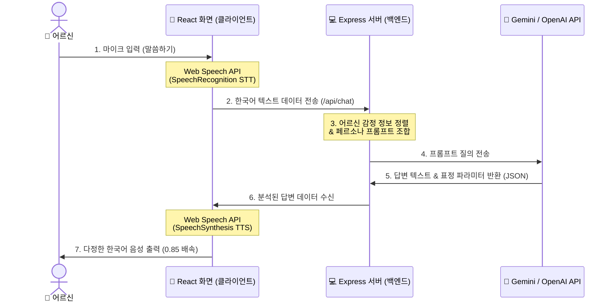
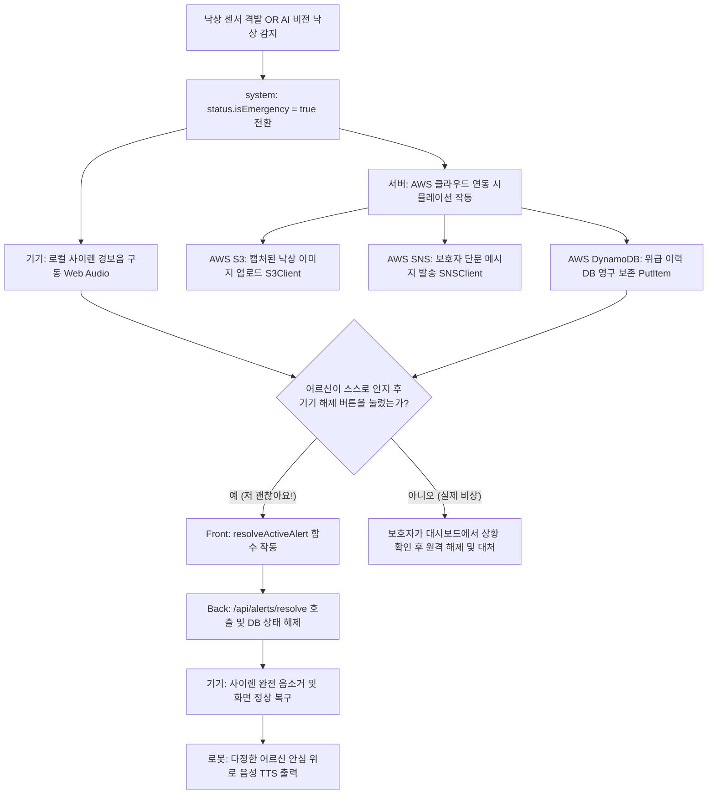

# 실버 케어 반려 로봇 핵심 알고리즘 상세 명세서 (S/W 코드 기준)

본 명세서는 현재 작업 디렉토리(`C:\Users\fredh\.gemini\antigravity\scratch\silver-care-robot`)에 개발되어 있는 소스 코드를 바탕으로 **1. 실시간 대화 알고리즘**, **2. 멀티모달 비전 판단 알고리즘**, **3. 응급 대응 및 기기 해제 알고리즘**의 입력, 처리, 출력 전 과정을 세부적으로 기술한 기술 문서입니다.

---

## 1. 실시간 대화 알고리즘 (Web Speech STT/TTS & LLM Chat)

어르신의 마이크 입력을 문자화하고, 대화형 AI(Gemini/OpenAI)로 상냥한 대답을 생성한 후, 어르신이 듣기 편안한 어조의 목소리로 합성하여 출력하는 대화 제어 파이프라인입니다.



### [상세 처리 흐름]

#### A. 음성 텍스트화 (STT - SpeechToText)
* **파일**: `frontend/src/components/RobotSimulator.jsx` (lines 28~62)
* **알고리즘 상세**:
  1. 기기 브라우저 표준인 `window.SpeechRecognition || window.webkitSpeechRecognition`을 통해 인스턴스를 동적 생성합니다.
  2. 음성 인식 언어를 한국어(`lang = 'ko-KR'`), 단발성 질의 모드(`continuous = false`), 완성형 텍스트 검출 모드(`interimResults = false`)로 파라미터를 초기 설정합니다.
  3. 마이크 활성화 이벤트(`onstart`) 발생 시, 로봇 얼굴의 시각 상태를 연산 중(`robotEmotion = 'thinking'`)으로 변경하고 화면에 파동 리플 효과를 활성화하여 어르신께 입력 상태를 피드백합니다.
  4. 음성 주파수 입력이 완료되면 `onresult` 콜백을 호출하여 `event.results[0][0].transcript`에서 텍스트 결과값을 추출하고 즉시 백엔드 대화 API(`POST /api/chat`)로 전송합니다.

#### B. 대화 답변 및 감정 파라미터 생성 (백엔드)
* **파일**: `backend/server.js` (lines 147~248)
* **알고리즘 상세**:
  1. 입력된 텍스트와 현재 어르신의 표정 상태(`seniorExpression`)를 조합하여 질의 패킷을 생성합니다.
  2. `GEMINI_API_KEY`(또는 향후 `OPENAI_API_KEY`) 유효성을 식별합니다.
  3. API 자격 증명이 유효한 경우, "다정하고 귀여운 반려 로봇 효돌이" 역할을 수행하도록 설계된 시스템 페르소나 프롬프트를 AI 모델에 전송합니다. 이때 출력 포맷을 `{ "text": "답변 내용", "emotion": "감정단어" }` 형태의 정격 JSON 형식으로 제한하여 반환받고 이를 파싱합니다.
  4. API 키가 없거나 통신 장애가 발생한 경우, 백엔드의 키워드 매칭 엔진(정규식 분석)이 작동합니다.
     - 통증 관련 키워드(`아프`, `가슴`, `숨`, `넘어져`) 감지 시: 즉시 긴급 알림을 자동 격발하고 걱정스러운 위로 멘트와 함께 위급 상태 플래그를 켭니다.
     - 일상 대화 키워드(`날씨`, `밥`, `심심`, `안녕`) 감지 시: 사전에 규정된 어르신용 다정체 한국어 메시지와 매칭하여 자연스럽게 응답합니다.
  5. 답변이 완성되면 로컬 데이터베이스(`database.json`)에 대화 기록을 보존하고 반환합니다.

#### C. 한국어 음성 합성 출력 (TTS - TextToSpeech)
* **파일**: `frontend/src/components/RobotSimulator.jsx` (lines 112~149)
* **알고리즘 상세**:
  1. `SpeechSynthesisUtterance` 객체를 초기화하고 읽을 답변 텍스트를 할당합니다.
  2. 브라우저의 오디오 드라이버에 등록된 음성 엔진 중 한국어 로컬 보이스(`v.lang.includes('KO')` 등)를 검색하여 재생 객체에 바인딩합니다.
  3. 고령자 맞춤 음향 처리를 위해 읽기 속도를 일반 속도 대비 다소 느린 `rate = 0.85`, 피치는 `pitch = 1.0`으로 고정 변조합니다.
  4. 재생 시작(`onstart`) 이벤트 발생 시 로봇의 감정을 행복 표정(`happy`)으로 설정하여 입 모양 애니메이션이 진동하도록 연동하고, 재생 종료(`onend`) 시 기본 표정(`neutral`)으로 원복 후 `window.speechSynthesis.speak()`로 물리 사운드를 출력합니다.

---

## 2. 멀티모달 비전 판단 알고리즘 (Gemini Vision)

로봇의 카메라 모듈을 통해 사용자의 실시간 영상 데이터를 분석하여 거실의 낙상 사고 및 사용자의 표정 변화를 교차 판단하는 영상 인식 파이프라인입니다.

```
[카메라 비디오 스트림 수집]
       │ (getUserMedia API 구동)
       ▼
[HTML5 Video 엘리먼트 바인딩]
       │ (실시간 화각 확보)
       ▼
[비디오 프레임 Canvas 복사 및 캡처]
       │ (ctx.drawImage 동작)
       ▼
[Base64 JPEG 바이너리 변환 (canvas.toDataURL)]
       │
       ▼
[백엔드 비전 분석 API 송신 (/api/vision)]
       │
  ┌────┴────┐ (GEMINI_API_KEY 검증)
  ▼         ▼
[실제 AI 모드]                      [시뮬레이터 모드]
Gemini 1.5 Flash                    선택된 시뮬레이터 상태
멀티모달 이미지 분석 질의             (smiling, sleeping, fell_down 등)
  │                                   을 매핑하여 가상 데이터 처리
  └────┬────┘
       ▼
[판독 결과 반환 및 DB 반영]
- 어르신 관찰 여부 (hasPerson)
- 위급 상태 식별 (isEmergency)
- 표정 진단 (expression)
- 1줄 요약문 (summary)
```

### [상세 처리 흐름]

#### A. 프레임 캡처 및 바이너리 추출
* **파일**: `frontend/src/components/RobotSimulator.jsx` (lines 278~360)
* **알고리즘 상세**:
  1. 로봇 카메라가 켜지면 `navigator.mediaDevices.getUserMedia({ video: true })` API를 통해 로컬 비디오 장치 스트림을 획득하고 화면의 `<video>` 노드에 렌더링합니다.
  2. 사용자가 분석을 수행하거나 기기가 주기적 정밀 순찰을 시작하면, 숨겨진 임시 `<canvas>`의 컨텍스트를 획득하여 현재 비디오 피드의 픽셀 데이터를 동일 해상도로 드로잉합니다 (`ctx.drawImage(video, 0, 0)`).
  3. 캔버스에 그려진 이미지 메모리 정보를 `canvas.toDataURL('image/jpeg')`로 호출하여 압축된 Base64 인코딩 바이너리 문자열로 변환하고 서버에 전송합니다.
  4. 웹캠 미사용 시에는 시뮬레이터 옵션값(`smiling`, `fell_down` 등)에 맞게 캔버스에 쓰러진 모습 등의 간이 기하학 형상을 자체 렌더링한 후 동일한 Base64 스트림으로 포장하여 송신함으로써 동일한 규격의 입력을 유지합니다.

#### B. 비전 분석 및 감지 판정 (백엔드)
* **파일**: `backend/server.js` (lines 250~345)
* **알고리즘 상세**:
  1. 수신한 Base64 데이터를 바이너리 버퍼로 복원합니다.
  2. API 키가 유효할 경우, Gemini 멀티모달 이미지 파트에 데이터 바인딩을 수행합니다.
  3. 비전 분석용 프롬프트(`This is a camera stream snapshot...`)를 구성하여 이미지 분석을 시도합니다. 이 프롬프트는 이미지 내에 어르신이 있는지 여부(`hasPerson`), 바닥에 쓰러졌거나 신음하는 응급 상황 여부(`isEmergency`), 현재 인물의 표정 상태(`expression`), 한국어 요약(`summary`) 데이터를 포함한 정격 JSON 포맷으로 답하도록 강제합니다.
  4. AI 비전 모델이 반환한 응급 상태값(`isEmergency = true`)이 수신되거나, 시뮬레이터에서 낙상 강제 상태(`fell_down`)를 입력받은 경우, 백엔드는 즉시 시스템 전역 위급 플래그(`status.isEmergency = true`)를 켜고 아래 3번의 **'응급 대응 알고리즘'**을 트리거합니다.

---

## 3. 응급 대응 및 기기 해제 알고리즘 (AWS & Local UI)

낙상 센서 신호 또는 비전 판독을 통해 비상이 발생했을 때 클라우드 통합 전송을 모사하고 기기에서 오작동 시 수동으로 복구하는 예외 처리 및 복구 알고리즘입니다.



### [상세 처리 흐름]

#### A. AWS 연동 알림 파이프라인 (백엔드)
* **파일**: `backend/server.js` (lines 50~84, 347~380)
* **알고리즘 상세**:
  1. 기기의 물리적 낙상 감지 센서 신호가 들어오거나, 웹캠 비전에서 낙상이 감지되면 즉시 비상 격발 API가 활성화됩니다.
  2. 시스템은 즉시 안전 진단 상태를 비상 모드로 강제 격상하고 경보 고유 이력을 작성합니다.
  3. **AWS S3 저장소 연동**: 디버그 콘솔에 `S3Client.send(new PutObjectCommand(...))`의 호출 규격을 기록하여 base64 스냅샷 이미지가 지정 버킷에 안정적으로 보관됨을 보장합니다.
  4. **AWS SNS 문자 발송**: 위급 시각과 알림 정보를 매핑하여 보호자 스마트폰으로 SMS를 즉각 발송하는 `SNSClient.send(new PublishCommand(...))`를 수행 및 콘솔에 기록합니다.
  5. **AWS DynamoDB 로깅**: 향후 이력 추적을 위해 사건 고유 ID와 세부 내용을 `DynamoDBClient.send(new PutItemCommand(...))` 규격으로 호출하여 영구 저장소 기록을 매핑합니다.

#### B. 로컬 기기 경보 해제 연동 (클라이언트-백엔드)
* **파일**: `frontend/src/components/RobotSimulator.jsx` (lines 65~109, 542~585)
* **알고리즘 상세**:
  1. 비상 발동 시, 프론트엔드는 Web Audio API의 `OscillatorNode`와 `GainNode`를 활성화하여 주파수 변조 방식(`sawtooth`, 880Hz에서 554Hz로 하강하는 비상음 사이렌)의 경보음을 동적으로 생성하고, `alarmInterval` 루프를 통해 800ms 간격으로 경보음을 반복 송출합니다.
  2. 이때 화면이 적색 점멸 비상 모드로 변경되며, 중앙 하단에 **"💚 오작동 / 저 괜찮아요! (기기에서 경보 해제)"** 터치 버튼을 유일하게 출력합니다.
  3. 어르신이 기기에서 이 버튼을 클릭하면 `resolveActiveAlert()` 클라이언트 함수가 가동되어 서버의 `/api/alerts/resolve` API를 비상 이력 ID와 함께 비동기 호출합니다.
  4. 서버는 해당 경보의 `resolved` 상태를 참(`true`)으로 갱신하고 남아있는 미결 경보가 없음을 검사한 후, 전역 위급 상태(`db.status.isEmergency`)를 거짓(`false`)으로 리셋하여 보존합니다.
  5. 기기는 요청 성공 응답을 받는 즉시 `stopLocalAlarmSound()`를 호출해 오디오 컨텍스트를 닫고 경보음을 영구 차단(Mute)하며 화면을 정상 파란색 상태로 복귀시킵니다.
  6. 복귀 직후 로봇은 다시 기본 감정 상태로 돌아오며 어르신께 안심을 유도하는 다정한 멘트의 TTS 오디오를 재생하고 대기 상태로 무중단 복귀합니다.
