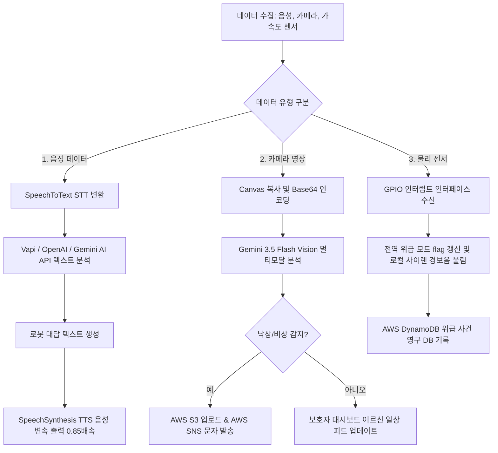

# 실버 케어 반려 로봇 데이터 수집 및 처리 정의서

본 정의서는 반려 로봇 및 모니터링 시스템에서 발생하는 음성, 영상, 기기 센서 데이터의 수집 방식, 처리 흐름, 변환 알고리즘 및 저장/배포 구조를 명확히 정의하여 데이터 흐름의 일관성과 시스템 안전성을 보장하는 데 목적이 있습니다.

---

## 1. 데이터 수집 명세 (Data Collection Specification)

시스템이 고령자 단말기(라즈베리파이 및 시뮬레이터)로부터 수집하는 4대 핵심 데이터 자원 정의입니다.

| 데이터 구분 | 데이터 소스 (물리 장치) | 수집 형태 및 규격 | 수집 주기 (Trigger) |
| :--- | :--- | :--- | :--- |
| **고령자 음성 (Audio)** | ReSpeaker 4-Mic Array (USB/오디오 카드) | 아날로그 주파수 ➔ 16-bit PCM Mono Wav (Web Speech API 연동 문자 변환) | 어르신이 기기를 호출하거나 음성 버튼 터치 시 활성화 (비동기 실시간) |
| **현장 스냅샷 (Image)** | 카메라 모듈 3 Wide (CSI 포트) | JPEG 이미지 포맷 (Base64 인코딩 스트림으로 전송) | 10초 주기 자동 순찰 감지 및 응급 상태 감지 시 즉시 수집 |
| **물리 센서 (Sensor)** | 가속도 센서 / SOS 버튼 (GPIO 포트) | 디지털 하이/로우 신호 및 가속도 임계값 돌파 인터럽트 신호 | 실시간 하드웨어 핀 변화 이벤트 발생 시 즉시 감지 (즉시 격발) |
| **시스템 로그 (Log)** | 단말기 내부 상태 및 웹 피드백 | JSON 오브젝트 (상태값, 감정 단어, 타임라인 기록) | 대화 완료, 조치 완료 등 주요 상태 변경 시 실시간 수집 |

---

## 2. 데이터 처리 및 변환 프로세스 (Data Processing Flow)

수집된 데이터가 AI 분석 및 위급 상황 전송을 위해 가공되고 클라우드에 연동되는 알고리즘 절차입니다.

---

## 3. 세부 처리 정의 (Processing Rules)

### A. 음성 신호 처리 및 대화 분석
1. **수집 및 정제**: ReSpeaker 하드웨어 DSP 칩을 통해 음향 에코 및 거실 백그라운드 노이즈(TV 소리 등)를 하드웨어 수준에서 1차 차단합니다.
2. **STT 변환**: 브라우저 표준 Web Speech Recognition 엔진을 통해 사용자의 실시간 말소리를 정밀 텍스트(String)로 디코딩합니다.
3. **페르소나 매핑 및 감정 판정**: 백엔드는 텍스트 데이터를 받아 정서 안정 목적의 다정체 페르소나 지시 프롬프트와 현재 어르신 상태 변수를 조합해 AI 모델에 전송합니다. AI 모델은 답변 문장과 함께 로봇 얼굴에 표출할 최적의 감정 상태(happy, neutral, sad, concerned, thinking)를 분리하여 JSON으로 생성합니다.
4. **TTS 안심 출력**: 수집된 AI 답변을 어르신의 청각 특성에 맞춰 기본 속도보다 15% 감속된 `0.85`배속 속도로 합성하여 로컬 스피커로 출력합니다.

### B. 비전 기반 낙상 및 정서 분석
1. **이미지 캡처**: 순찰 카메라의 실시간 비디오 프레임을 HTML5 Canvas 버퍼 공간에 드로잉한 뒤 `canvas.toDataURL('image/jpeg')`를 가동하여 네트워크 전송에 용이한 Base64 스트림 데이터로 압축 변환합니다.
2. **멀티모달 비전 인지**: 백엔드는 Base64 데이터를 수신해 이미지 파트로 패킹하고 `gemini-3.5-flash` 모델을 활성화하여 1) 인물 감지 여부, 2) 바닥 쓰러짐(낙상) 위급 상태 여부, 3) 얼굴의 통증(pain)/안정(neutral)/웃음(happy) 상태 분석을 실시간 질의합니다.
3. **안전성 교차 판정**: AI 분석 결과에서 낙상으로 감정 및 비상이 감지되면 즉시 전역 위급 모드 변수를 참(`true`)으로 전송하고 보호자 푸시를 가동합니다.

### C. 응급 대응 및 가상 클라우드 저장성 규격
1. **클라우드 미디어 스토리지 (AWS S3)**: 비상 순간의 캡처 버퍼 이미지를 바이너리로 복원하여 AWS S3 저장소에 `alerts/snapshot_[타임스탬프].jpg` 주소로 고유 저장하여 원격 증빙 화질을 확보합니다.
2. **보호자 메시징 (AWS SNS)**: 보호자의 모바일 문자 번호로 비상 상황 발생 유형과 발생 시각을 결합하여 고우선순위(High Importance) 경보 문자 메시지를 즉시 전송합니다.
3. **활동 및 이력 데이터베이스 (AWS DynamoDB)**: 
   - 모든 경보 발생 사건의 고유 ID, 발생 시각, 경보 종류, 이미지 URL 및 기기 터치스크린/보호자 앱 조치 여부(`resolved: true/false`)를 DynamoDB에 영구 보관합니다.
   - 평상시의 어르신 대화 건수, AI가 진단한 일별 감정 분포 비중은 일자별 타임라인 형식으로 로컬 데이터 및 클라우드 DB에 통산 합산하여 보호자 모니터링 대시보드 화면에 날짜별로 그래프화하여 표출합니다.
