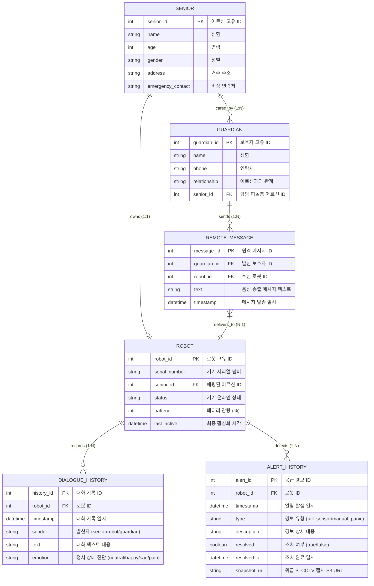

# 실버케어 로봇 데이터베이스 ERD 명세서

본 문서는 실버케어 반려 로봇 시스템에서 사용되는 관계형 데이터베이스의 논리적 설계 구조(ERD)를 수록하고 있습니다.

## 📊 ERD (Mermaid Diagram)

## 🗄️ 엔티티 설명 및 관계 정의

### 1. SENIOR (피돌봄 어르신)
- **설명**: 시스템의 핵심 돌봄 대상이 되는 노인 어르신 정보입니다.
- **관계**: 
  - `ROBOT`과 **1:1** 매핑 관계를 가집니다. (어르신 한 분당 전용 Companion 로봇 1대 보유)
  - `GUARDIAN`과 **1:N** 관계를 가집니다. (어르신 한 분당 여러 명의 가족 보호자 등록 가능)

### 2. ROBOT (반려 로봇 기기)
- **설명**: 어르신 댁에 설치된 라즈베리파이 5 기반의 물리 로봇 단말기 사양 및 상태 정보입니다.
- **관계**:
  - `DIALOGUE_HISTORY`(대화 이력)를 **1:N** 관계로 기록합니다.
  - `ALERT_HISTORY`(응급 감지 이력)를 **1:N** 관계로 누적 기록합니다.

### 3. GUARDIAN (보호자)
- **설명**: 어르신의 건강 및 위급 상태를 모니터링하고 원격 메시지를 송신하는 가족 보호자 정보입니다.
- **관계**:
  - `REMOTE_MESSAGE`(원격 TTS 송신 이력)를 **1:N** 관계로 전송합니다.

### 4. DIALOGUE_HISTORY (대화 이력 로그)
- **설명**: 어르신-로봇 AI-보호자 메신저 대화방 간에 나눈 실시간 음성/텍스트 대화의 데이터 로그입니다.
- **감정 필드 (`emotion`)**: 대화 내용 및 어르신 표정 분석을 통해 실시간으로 정서(행복/보통/슬픔/통증 등)를 진단하여 통계 지표로 활용합니다.

### 5. ALERT_HISTORY (응급 센서 감지 로그)
- **설명**: 가속도 낙상 센서 및 보호자 수동 긴급 버튼 작동 시 기록되는 위급 조치 이력입니다.
- **AWS 연동 정보**: 비상 상황 격발 시 AWS S3에 캡처 이미지가 전송되며 (`snapshot_url`), 보호자 휴대전화 문자(SNS) 및 조치 여부(`resolved`) 상태를 기록합니다.
