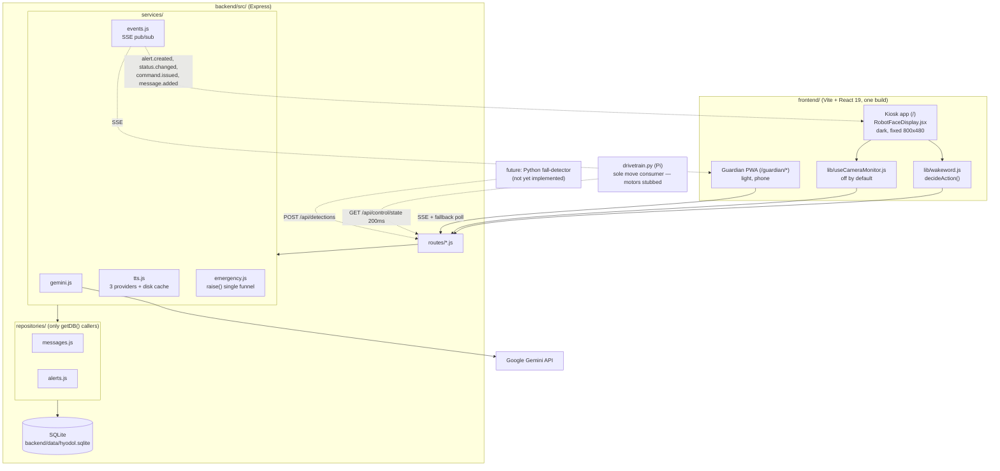
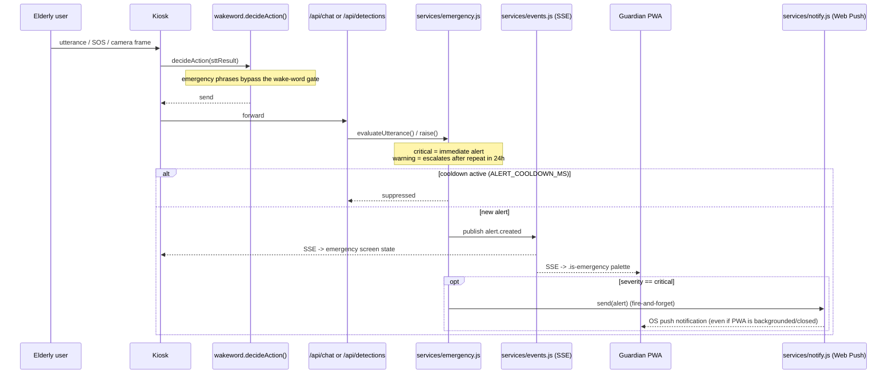
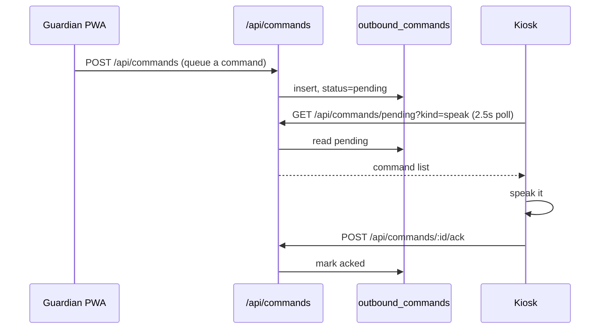
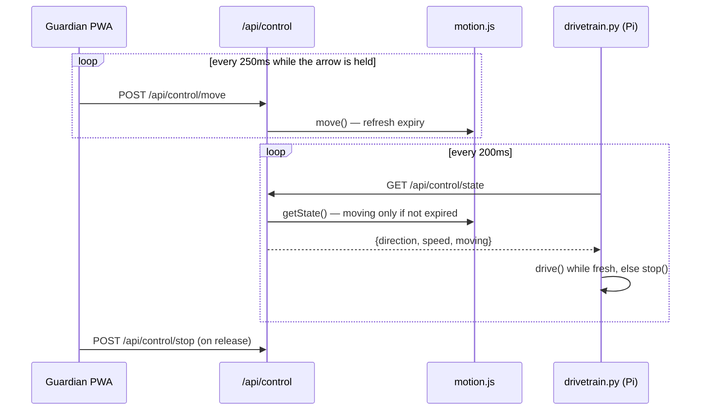
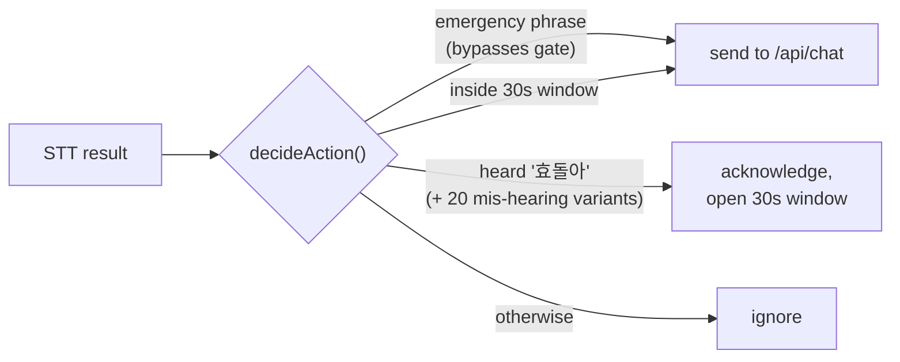

# Architecture

Background for `CLAUDE.md`'s "Architecture notes" pointer — component layout and the key
runtime flows. Read `CLAUDE.md` (root) first for the project overview and the four rules that
matter when writing new code; this doc is the "why/how it fits together" reference.

## Components

## Emergency alert flow

Voice, vision, manual SOS, and external detectors all funnel through the same path.

## Command queue (pull-then-ack)

Not a destructive GET — a command stays pending until its consumer explicitly acknowledges it.
Used for commands that **must not be lost**: a `speak` that arrives late is still worth saying.

**The kiosk acks `speak` only.** Since 2026-08-31 it *observes* `move` (to draw the `⬅️ 이동 중`
indicator) without acking, because the drivetrain process must be the sole consumer — if the
browser acked first, the motors would never see the command.

## Remote control (hold-to-drive)

Movement is the **opposite** of the queue's contract: a stale move must be *dropped*, not
delivered. So the pressed direction is not a queued command — it is current intent held in
`services/motion.js` with an expiry, and the drivetrain reads it directly.

**Stopping is what happens when intent stops arriving**, not when a stop signal arrives — so a
locked phone, a dropped Wi-Fi link, or a dead EC2 all halt the robot. `POST /api/control/stop`
only makes that faster; it is not the safety mechanism. A queue row is written **once per
direction change** (not per heartbeat) so the audit trail and the kiosk indicator survive.

During an emergency all four layers engage: `dropPending('move')` clears the queue in-transaction,
`motion.stop()` halts intent, `/api/control/move` returns `423`, and the guardian's buttons
disable. `/api/control/stop` is deliberately **not** locked — the one thing that must never
become unavailable is stopping.

## Wake-word gate

## Other notes

- **Backend is modular, not a single file.** `server.js` only wires things up; see
  `backend/CLAUDE.md` for the `src/` layout.
- **SQLite, not JSON.** `backend/data/hyodol.sqlite` (gitignored, `node:sqlite`/`DatabaseSync`,
  no native build). `backend/scripts/migrate-json-to-sqlite.js` is a one-time, idempotent import
  from the old `database.json`.
- **TTS has three interchangeable providers** (`services/tts.js`, `TTS_PROVIDER`): `browser`
  (client SpeechSynthesis, default, 0 latency), `gemini` (same API key, ~5s latency per novel
  sentence), `cloud` (Google Cloud TTS, same key + one-time GCP console API enable, low
  latency). Output is disk-cached by content hash; `npm run prewarm-tts` warms common phrases.
- **Emergency push is standard Web Push (VAPID)**, not a cloud push service — `services/notify.js`
  sends via the `web-push` npm package, gated to `severity === 'critical'` only (warnings never
  push, to avoid the guardian disabling notifications after false positives). Requires HTTPS to
  reach the guardian's browser (`VAPID_PUBLIC_KEY`/`VAPID_PRIVATE_KEY` in `backend/.env`,
  `VITE_VAPID_PUBLIC_KEY` in `frontend/.env`).
- **Camera/vision pipeline is wired but off by default.** `frontend/src/lib/useCameraMonitor.js`
  posts a frame to `/api/vision` every `VITE_VISION_INTERVAL_MS` when `VITE_VISION_ENABLED=true`.
  Real fall detection (YOLOv8) isn't implemented — see `docs/fall-detection.md` for the
  `POST /api/detections` contract; `backend/scripts/mock-detector.js` exercises the same path
  without a real model.
- **Two apps, one build.** `App.jsx` routes `/` to the kiosk and `/guardian/*` to the guardian
  PWA. They share `lib/api.js` and the backend but nothing else — different palettes,
  typography, and layout, because a robot face on a wall-mounted Pi and a worried adult child's
  phone are different objects. Kiosk-only global CSS (`user-select:none`, page-scroll lock,
  hidden scrollbars) is scoped to `.kiosk-root`; putting it back on `*` breaks guardian
  scrolling.
- **Testing on a phone** requires `server.host: true` in `vite.config.js` (already set) and the
  PC's LAN IP — `npm run dev` prints it. The kiosk's voice loop and the guardian's SSE both need
  a real device to verify meaningfully.
- **Security headers + auth**: `X-Frame-Options`/`X-Content-Type-Options`/`X-XSS-Protection` plus
  a shared-secret `x-api-key` check (`middleware/index.js`), open when `ROBOT_API_KEY` is unset.
  New routes go in `src/routes/*.js`, mounted under `/api` in `src/app.js`, before the catch-all
  error handler.
